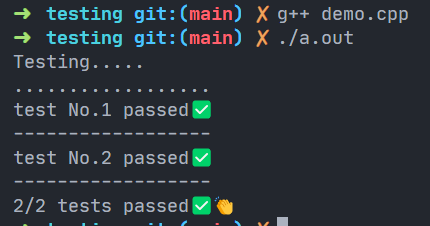

# Testing

## Content

- ***[How to include it?](#how-to-include-it)***
- ***[How to use it?](#how-to-use-it)***

## How to include it?

First download this [file](./UTest.h) and include it in your working directory like that:

```cpp
    #include "UTest.h"
```

## How to use it?

in `main` function create object fromt `UTest` class then call function `test` funciton take `vector of  pair` as `input`
`pair<out, exp>` here `out`: output of your function and `exp`: is expected output of your function

### Example
if we have a function called `sum` and this is it's implemenation
```c++
    int sum(int x, int y) {
        return x+y;
    }
```

now we want to test this function and we already have test cases

```
input: 1 2
expected: 3

input: 3 4
expected: 7
```

```c++
    int main() {
        UTest testObj;
    
        vector<pair<int, int>> testStream {
            make_pair(sum(1, 2), 3),
            make_pair(sum(3, 4), 7)
        };
    
        testObj.test(testStream);
    }
```

```cpp
    #include <bits/stdc++.h>
    #include "UTest.h"
    
    using namespace std;
    
    int sum(int x, int y) {
        return x + y;
    }
    
    int main() {
        UTest testObj;
    
        vector<pair<int, int>> testStream {
            make_pair(sum(1, 2), 3),
            make_pair(sum(3, 4), 7)
        };
    
        testObj.test(testStream);
    }
```

#### output

